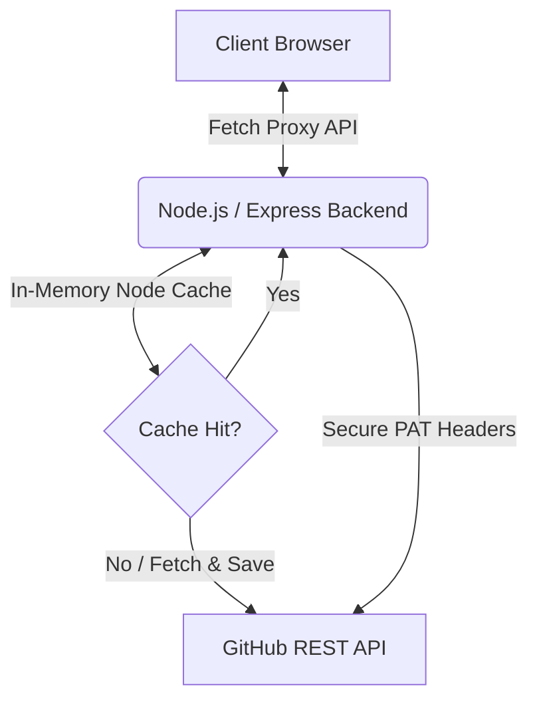

# 🧮 GitSum — GitHub Profile Summarizer

[](https://github.com/AtharvaKailasKadam/GitSum/actions)
[](LICENSE)
[](https://gitsum.vercel.app/)

GitSum is a polished, production-grade, full-stack web application that takes a GitHub username and visualizes their entire coding footprint into a premium SaaS-style dashboard. The project spans a modern React frontend and a robust Node.js/Express API gateway that addresses GitHub's public API limits securely.

---

## 🏗️ Architecture



---

## 🌟 Key Features

- **Full-Stack Security:** Attach GitHub Personal Access Tokens (PAT) safely on the server side. Frontends calling the proxy benefit from 5,000 requests/hour limits without exposing credentials.
- **Resilient Caching:** Server-side in-memory caching with configurable TTL (1h to 24h depending on route) reduces redundant calls, speeds up repeated visits, and prevents quota leakage.
- **AI-Generated Developer Narrative:** Integrates a swappable LLM proxy service (Gemini, Claude, OpenAI) to analyze developer activity profiles and generate custom factual narratives.
- **Interactive Profile Q&A Analyst:** A collapsible chat pane supporting multi-turn conversations about the active developer's profile, protected with strict rate limits (10 questions/min).
- **GraphQL Contribution Calendar:** Interactive 12-month calendar heatmap displaying total contributions, active streaks, and weekday activity trends.
- **Repository Health Checker:** Evaluates top 10 repositories against standard best practices (presence of README, LICENSE, CI/CD configs, tests, descriptions, and recent update activity) producing an audit score from 0-100.
- **Achievements Badges Shelf:** Unlocks custom gamified achievements (Polyglot, Star Collector, Prolific Builder, Consistent, Open Sourcerer, Well Documented) based on live developer metrics.
- **Profile README Renderer:** Safe base64 decoding and purified markdown rendering (using rehype-sanitize) of the developer's self-titled profile README.
- **Compare Mode:** Side-by-side radar-chart index comparisons of multiple developer profiles normalized to peak performance benchmarks.
- **Print to Resume PDF:** Responsive print stylesheet (`@media print`) that formats the entire dashboard as a clean, printable 1- or 2-page developer resume.
- **Search, Filter & Sort:** Debounced text search, programming language filter selection, and multiple sort attributes (stars, forks, updates, names) with layout transitions.
- **Recently Viewed History:** LocalStorage sync displaying recently viewed profiles on the Login page with avatar chips and clear history controls.
- **"GitHub Wrapped" recap:** Gorgeous fullscreen multi-slide slideshow recap displaying yearly stats, footprints, and coding archetype.
- **Aesthetic UI/UX Design:** Dark mode by default with geometric styling, elegant border glassmorphism, responsive breakpoints, and modern typeface pairings.

---

## 🛠️ Tech Stack

| Frontend | Backend | Testing & CI/CD |
|---|---|---|
| React 19 + Vite 7 | Node.js + Express | Vitest & Supertest |
| Framer Motion | Express Rate Limit | React Testing Library |
| React Router 7 | Node-Cache (TTL) | GitHub Actions CI |
| html-to-image | Morgan Logger | ESLint & Prettier |

---

## ⚙️ Environment Variables

### Frontend (`/GitSum/.env`)
```env
# Proxy API URL. Points to Express locally. In production, change to the deployed server.
VITE_API_BASE_URL=http://localhost:3001/api
```

### Backend (`/server/.env`)
```env
# Optional but recommended: Raises GitHub rate-limits to 5000/hr
GITHUB_TOKEN=your_personal_access_token_here

# Port to serve local traffic
PORT=3001

# Allowed origin for CORS validation
CLIENT_ORIGIN=http://localhost:5173
```

---

## 🚀 Installation & Local Development

You can run both parts in separate terminal windows.

### 1. Backend Setup
```bash
# Navigate to the server folder
cd server

# Install dependencies
npm install

# Setup environment
cp .env.example .env

# Run development server with watch mode
npm run dev
```

### 2. Frontend Setup
```bash
# Navigate to the frontend folder
cd GitSum

# Install dependencies
npm install

# Setup environment
cp .env.example .env

# Start local server
npm run dev
```

---

## 🧪 Testing

Both layers have full unit and integration test coverage powered by **Vitest**.

### Run Frontend Tests
```bash
cd GitSum
npm run test
```

### Run Backend Tests
```bash
cd server
npm run test
```

---

## 🧠 Design Decisions & Trade-offs

### 1. Why introduction of a Backend?
Unauthenticated frontend calls directly requesting `api.github.com` hit a strict IP-based limit of 60 requests/hour. To raise this limit to 5,000 requests/hour, a GitHub PAT (Personal Access Token) is required. Hardcoding or passing a PAT in client-side code exposes the token in devtools network traffic. A Node.js backend proxy resolves this by attaching the token securely server-side.

### 2. Caching Strategy
Using an in-memory cache (`node-cache`) with a 5-minute TTL serves two purposes:
- Speed: Requests for the same profile load instantly from memory on a cache hit (0ms).
- Surviving API downtime: If GitHub's service degrades, we serve stale data to users while reducing our rate-limit consumption.

### 3. Physics Simulation Optimization
To enhance user experience, we preserved the physics simulation. However, to make it production-ready, we listened to `visibilitychange` events and paused the animation frames if the tab was inactive (saving GPU and battery usage). We also gated the loop behind a `prefers-reduced-motion` check to honor browser accessibility configurations.

---

## 🎙️ Interview Talking Points

1. **Secret Token Management:** *"I designed an Express proxy to route GitHub API calls. By moving token attachment to the backend, I increased the request limit to 5000/hr without exposing critical GitHub credentials to the browser."*
2. **Caching & Resilience:** *"I built an in-memory TTL caching layer. It prevents redundant GitHub API calls on page reloads, drops page loads to 0ms on cache hits, and provides structural buffer in case of upstream rate-limiting."*
3. **Decomposition:** *"I decomposed the initial 517-line monolithic profile page into 11 single-responsibility components (ProfileOverview, QuickStats, TechStack, TopRepos, etc.) managed by a parent orchestrator. This improved codebase maintainability, isolated error states, and allowed us to write focused component tests."*
4. **Animation Gating & Accessibility:** *"I integrated Framer Motion for premium transitions. Importantly, I audited the animations to ensure they respect the user's system preferences. I used the `prefers-reduced-motion` media queries to disable the physics simulation and page slides for accessibility-first rendering."*
5. **Performance Optimizations:** *"I used React.lazy to split routing bundles, decreasing the initial paint bundle footprint. Additionally, third-party stats card assets are lazy-loaded only when they intersect with the viewport."*
